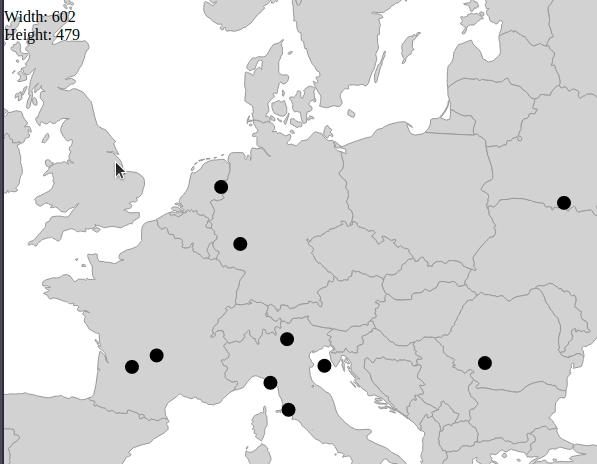
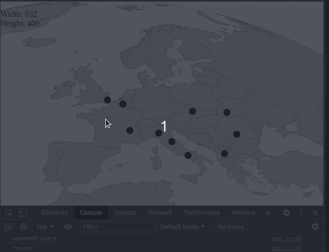

# What is this about?
This challenge is part of the KINEXON interview process for full stack developers. 
It gives you the opportunity to show us your skills, interests and how you work in
general.

We provided a not particularly well-written backend in server.py. It creates a REST
API that serves data with locations. There is one TODO in the code that we'd like
you to implement. You can decide whether you want to work with rest of the code as it
is and focus on the frontend or whether you'd prefer to show your refactoring and
backend skills by cleaning up and extending the python backend.
On the frontend side, you can build whatever you want. Choose the technologies that
you enjoy and get creative.

It is not expected that you build a lot of stuff and that everything is 100% polished.
Simply try to give us a glimpse of what we can expect from you. 
You can also add comments or update the Readme file to give us an idea about the things you would do if you 
had more time or resources.

# Starting the server
To start the server run the shell script start.sh from the command line:  
chmod 755 start.sh  
./start.sh  
This installs all requirements in a virtual environment and starts the server.  
Please make sure python (including pip) is installed and available in your path.   
The shell script is written for python3 and Unix/macOS. if you are a windows user or 
if you prefer to use python2, you might have to change a thing or two for setting up 
the virtual environment.

# Usage
To see the index.html for the frontend, open your browser at:
http://localhost:8080/  
The backend additionally serves a REST API under  
GET http://localhost:8080/  
The response is a list of drivers containing some profile information and
geographical positions.

# Result
Client fetches every 5 sec drivers from server and renders them on svg map.
Hovering over the dots that represent drivers shows a tooltip with all information 

## Mercator projection

## orthographic projection
